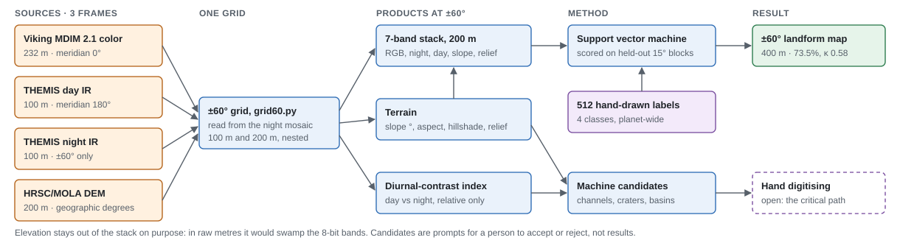

# Mars Global Mosaic

[](https://github.com/loggger101/Mars_Terrestrial_GlobalMosaic_GIS-Data/actions/workflows/check.yml)

**Mapping Lava Flows, Fluvial Channels, and Impact Craters in Visible and Infrared.**
Logan M Edwards · OCN 4704 Remote Sensing · Fall 2026 · Florida Institute of Technology

An ArcGIS Pro project that co-registers Viking visible color, THEMIS day and night thermal infrared and the HRSC/MOLA elevation model of Mars, then uses the stack to map three landform families: volcanic flow units, fluvial channels and valley networks, and impact craters. The scientific hook is Athabasca Valles, mapped for decades as a water-cut outflow channel before it was reinterpreted as flood lava. Morphology together with thermal response is this project's way of telling the two apart.

The analysis extent is **±60° latitude** (86.6% of the surface), set by the coverage of the THEMIS night mosaic. The detail work is done in a type area at **Ius Chasma**, western Valles Marineris (~271–286°E, 6–13°S).

This repository is the project page and an off-drive backup of the project. The working copy lives on an external drive (about 390 GB with all derived rasters). The tree holds everything small: the scripts, the knowledge base, the ArcGIS project file, the hand-drawn training labels and every vector layer, the layouts, the logs and the deliverables. The rasters go in two [releases](https://github.com/loggger101/Mars_Terrestrial_GlobalMosaic_GIS-Data/releases).

**Contents:** [knowledge base](Mars%20Remote%20Sensing%20Project/PROJECT-KNOWLEDGE.md) (the full record, every number tagged verified or open) · [rasters](docs/rasters.md) and [vector layers](exports/README.md) (what each one is) · [build scripts](docs/scripts.md) (all 130, by purpose) · [backup and restore](docs/backup.md)


## How it works



The four sources sit in three coordinate frames. Everything is put on one grid read from the night mosaic, so the day–night pair is never resampled and the DEM lands on its native 200 m. Elevation is kept out of the classification stack on purpose: in raw metres it would swamp the 8-bit bands, and an earlier map that included it turned out to be mostly an elevation map. The machine candidates are prompts for a person to accept or reject, not results.

## Where it stands (2026-10-08)

The interim report and presentation are due **mid-November 2026** and the final deliverable **8 December 2026**. Presentation 1 and the prospectus are delivered. The interim deck and report are generated from one source and rebuilt as results come in ([`NEXT STUFF/`](Mars%20Remote%20Sensing%20Project/NEXT%20STUFF)). The working plan is [`NEXT-STEPS.md`](Mars%20Remote%20Sensing%20Project/NEXT-STEPS.md).

| Task | State |
|---|---|
| Raster acquisition, including THEMIS Night IR | done; all four inputs match their published sizes; the night mosaic its MD5 too |
| CRS harmonisation (the gate) | done at ±60°: one grid, defined once in [`grid60.py`](Mars%20Remote%20Sensing%20Project/build/grid60.py) and read from the night mosaic |
| Terrain derivatives | done at ±60°: slope in degrees on a metric grid, aspect, hillshade, no z-factor defect |
| Band composite | done: a 7-band, 8-bit ±60° stack at 200 m with no raw elevation band, 97.3% co-valid |
| Unsupervised classification | done for the type area (Iso Cluster, object-based segmentation, parameter sweep) |
| Supervised classification | done at ±60° on the 512 hand-drawn labels, scored on held-out 15° blocks |
| Channel and crater candidates | seeded: 2,610 channel candidates and 1,685 closed depressions in Ius Chasma, the same for Athabasca Valles, 5,144 basin candidates at ±60°; the Robbins crater catalogue (385,049) for reference |
| Landform digitising | **open, the critical path**: next step 1 |
| Map layouts | ten layouts in the project (below) |

### Next steps

In order, toward the interim (data cut 2 November) and the final on 8 December. The full list, with who does what and when, is the "Resume here" section of [`NEXT-STEPS.md`](Mars%20Remote%20Sensing%20Project/NEXT-STEPS.md). Every open question behind them is numbered in the [knowledge base, §11](Mars%20Remote%20Sensing%20Project/PROJECT-KNOWLEDGE.md#11-open-questions).

1. **Digitise the three landform layers** (task 11, the critical path). `Landform_LavaFlowMargins`, `Landform_ChannelCenterlines` and `Landform_CraterRims` exist and are empty. The map *Ius Chasma — digitising* and layout 06 put them over the machine prompts: the 188 steep, rock-floored channel candidates and the 1,685 crater candidates. Digitising starts as a review: each candidate's `Review` field (accept / reject / unsure) is set in the attribute table, and `build/accept_reviewed.py` copies only the accepted ones across; what the candidates miss (breached craters, lava margins) is drawn by hand (KB §46). Hand work in Pro; no heavy processing. Then re-export the geodatabase so the backup holds the new features ([keeping the backup current](docs/backup.md#keeping-it-current)).
2. **Settle the choices that change what gets trained or published:**
   - which class schema is current: `Composite Object Classes.ecs` swaps lava tube and steep/windy hills against every labelled file. Settle it before drawing more samples or training on the deep-learning export (q23);
   - whether to prune the 64% of channel candidates on ground under 2° of slope (q17);
   - boxes or pixel labels for the deep-learning export (q26);
   - how much smoothing to publish: 5 × 5 now, chosen by feature size (q27).
3. **Run the desktop jobs**, too heavy for the laptop. Every build script finds its own drive, so they run from `F:` on the desktop; the two no-space junctions (`TypeArea`, `Global60`) are recreated there once, and the scripts print the command (q22).
   - the ±60° crater and channel fine pass, `make_global_landforms.py`: about 7 hours measured, checkpointed per tile. Only the coarse basin pass has run. Check the output with `verify_global60.py`;
   - pyramids on the four source mosaics (q6).
4. **Run the remaining tests** on the laptop: composite stability (H3), tributary orders at 100 m (Q5), flow margins in IR against Viking at Athabasca (H1), and, once reviewed channels exist, gradient and thermal response by origin (H2).
5. **Write the interim and the final report and presentation**, from the layouts and the results above.

## Results so far

- **±60° landform classification**: a support vector machine on the hand-drawn labels, scored on 183 polygons in 15° blocks it never saw. **70.5%, κ 0.54** per pixel; **73.5%, κ 0.58** after a 5 × 5 majority filter, against 58.6% for one class everywhere. Normal Ground is reliable (99% producer's, 78% user's) and Crater behaves as cratered terrain. **The lava tube class isn't usable** (2% user's accuracy): 44 polygons are too few for a planet-scale class.
- **Does thermal infrared help? (test T1)**: on the same held-out split, the thermal bands add **+1.3 points** (95% interval +0.6 to +2.2). Slope and relief alone score 68.6%, κ 0.51, as well as all seven bands: the hand-drawn classes are landforms, and terrain decides them.
- **Against calibrated thermal inertia (T3)**: across ±60°, TES thermal inertia tracks Viking red (r −0.36), while the THEMIS mosaics keep only a weak signal inside regions (|r| ≈ 0.1). In the two type areas the diurnal-contrast index does not track it (r −0.22 to ≈ 0); Viking albedo does at Athabasca (−0.55, −0.64). Where a calibrated product can check, visible albedo carries the material signal.
- **Against the USGS geologic map (T8, T2)**: the classes sit where terrain puts them, and volcanic plains can't be separated from other plains in these bands, so lava flows are shown from the map's volcanic units. At Athabasca the flood lava (`lAv`) is the least cratered large unit: 1,122 catalogued craters per million km², against 1,760 and 2,183 on the older units.
- **The prospectus' hypotheses (T5–T7)**: no band separates the geologic map's lava contacts at Athabasca much better than chance (day IR 21.0%, Viking red 12.3%, chance 10%; the 1:20 M map is too coarse to settle it). The composite's Iso Cluster classes are the least reproducible input (west- vs east-trained agreement 0.40, against 0.61–0.89 for single bands). No channel threshold keeps first-order streams on real slopes: only 30.8–36.7% lie on ≥ 2°, so the tributary order count is a setting, not a measurement.
- **Two earlier SVM maps checked and superseded**: one follows its 4096-pixel processing tiles and scores below chance on its own training data. The other is mostly an elevation map.
- **Diurnal-contrast index**: calibrated thermal inertia can't be derived from the 8-bit, locally stretched THEMIS mosaics. A relative day–night contrast index can, and within the type area it is nearly independent of terrain (r = +0.11 against elevation, −0.25 against slope). It is not a restatement of topography, but against calibrated TES thermal inertia it barely tracks material (above), and it does not compare across the planet.
- **Type-area supervised accuracy**: 62.7%, κ 0.41 on terrain-defined classes. The thermal index adds +0.4 points there, as it should on terrain classes.
- **Channels**: `Fill` flooded Ius Chasma 2,077 m deep, and 56% of the stream cells in the first channel network were an artefact of it. Of the 2,610 candidates that remain, the 188 steep, rock-floored ones (1,037 km) are the ones worth digitising.
- **Craters**: 1,685 closed-depression candidates ≥ 1 km; against the Robbins catalogue only 11% are catalogued craters (21% at ≥ 2 km), so they are prompts, not a crater count. Large craters are measured well: Perrotin within 7.1% in diameter. The detector can't see breached craters such as Oudemans. At ±60°, 68% of the 117 IAU craters ≥ 100 km are recovered within ±50% in diameter.

The method, the traps and every number behind these are in [`PROJECT-KNOWLEDGE.md`](Mars%20Remote%20Sensing%20Project/PROJECT-KNOWLEDGE.md).

## Layouts

| | |
|---|---|
|  Ius Chasma, visible |  Ius Chasma, night IR |
|  Ius Chasma, classification |  Checks on the earlier SVM maps |
|  Ius Chasma, digitising candidates |  ±60° basin candidates |
|  The mosaic at ±60°: visible, day IR, night IR, topography |  Athabasca Valles, digitising candidates |
|  The ±60° locator: type areas and the geologic map's volcanic units | |

## Source data

Not in this repository: 62 GB, public. [`tools/check_remote.py`](tools/check_remote.py), run by hand, checks that each is still served at its address at the exact size the project drive holds. Put them at the root of the project drive.

| File | Size | Grid |
|---|---|---|
| [`Mars_Viking_MDIM21_ClrMosaic_global_232m.tif`](https://asc-pds-services.s3.us-west-2.amazonaws.com/mosaic/Mars_Viking_MDIM21_ClrMosaic_global_232m.tif) | 12.7 GB | 231.5 m, central meridian 0° |
| [`Mars_MO_THEMIS-IR-Day_mosaic_global_100m_v12.tif`](https://asc-pds-services.s3.us-west-2.amazonaws.com/mosaic/Mars_MO_THEMIS-IR-Day_mosaic_global_100m_v12.tif) | 22.8 GB | 100 m, central meridian 180° |
| [`Mars_MO_THEMIS-IR-Night_mosaic_60N60S_100m_v14.tif`](https://asc-pds-services.s3.us-west-2.amazonaws.com/mosaic/Mars_MO_THEMIS-IR-Night_mosaic_60N60S_100m_v14.tif) | 15.2 GB | 100 m, central meridian 180°, ±60° |
| [`Mars_HRSC_MOLA_BlendDEM_Global_200mp_v2.tif`](https://asc-pds-services.s3.us-west-2.amazonaws.com/mosaic/Mars/HRSC_MOLA_Blend/Mars_HRSC_MOLA_BlendDEM_Global_200mp_v2.tif) | 11.4 GB | 0.00337° geographic |

Three coordinate frames, not two: check `Central_Meridian` per file before reading a window, or THEMIS lands half a planet away. Their statistics sidecars (`.aux.xml`), the night mosaic's PDS label and MD5 are in [`drive-root/`](drive-root).

## Using the data

ArcGIS Pro is not required. The rasters are GeoTIFFs and the vectors come as a file geodatabase and a GeoPackage; QGIS and GDAL read all of them.

**Quick start.** Download the landform maps (400 MB) and unzip them:

```bash
curl -LO https://github.com/loggger101/Mars_Terrestrial_GlobalMosaic_GIS-Data/releases/download/data-2026-10-06/global60-classification.zip
unzip global60-classification.zip
```

Then, with GDAL's Python bindings (`osgeo`, from conda-forge or the Python that ships with QGIS), read the map and turn a pixel into longitude and latitude:

```python
from osgeo import gdal
import numpy as np, math
gdal.UseExceptions()

ds = gdal.Open("Global60/global60_landforms_svm_400m_mode5.tif")   # 400 m, 53,347 x 17,783
band = ds.GetRasterBand(1)
# A tenth of the full resolution is plenty for an overview.
a = band.ReadAsArray(buf_xsize=ds.RasterXSize // 10, buf_ysize=ds.RasterYSize // 10)
names = {1: "Crater", 2: "steep/windy hills", 3: "lava tube", 4: "Normal Ground"}
valid = a != band.GetNoDataValue()                                  # 255: no class
for code, name in names.items():
    print(f"{name:18} {np.mean(a[valid] == code):6.1%}")

# Map coordinates are metres on the Mars sphere, central meridian 180°E.
R = 3396190.0
x0, dx, _, y0, _, dy = ds.GetGeoTransform()
def lonlat(col, row):
    x, y = x0 + (col + 0.5) * dx, y0 + (row + 0.5) * dy
    return 180 + math.degrees(x / R), math.degrees(y / R)           # longitude 0–360°E, latitude
```

It prints Crater 33.2%, steep/windy hills 1.7%, lava tube 9.5%, Normal Ground 55.5%, the same shares as a full-resolution count. `lonlat` agrees with PROJ's own transform to 10⁻¹³ degrees.

- **Coordinate system.** Almost everything is in `Mars_Equidistant_Cylindrical_CM180`: metres on the Mars sphere (R = 3,396,190 m) with the **central meridian at 180°**, so x runs 0–360°E. The CRS is embedded in each file; keep it. Reprojecting to an Earth CRS, or assuming a 0° meridian, puts features half a planet away. The exception is the 30 Sep SVM map, `Classified_202609300147338582853`: same projection, but **central meridian 0°**, on Viking's grid. The hand-drawn labels and the IAU nomenclature are in geographic `Mars_2000_(Sphere)`.
- **The landform map** to use is `global60_landforms_svm_400m_mode5.tif`. Its pixel values are the class codes: **1 Crater, 2 steep/windy hills, 3 lava tube, 4 Normal Ground, 255 no class**, the same codes as the training labels; the attribute table adds names and colours. Read the lava tube class as unreliable (above). Every classified raster in the project follows the same rule: pixel value = class code.
- **The training labels** are `Landform_TrainingSamples_terrain` in [`exports/`](exports/README.md), with the same class codes 1–4. One class schema in the project swaps 2 and 3; the layer catalog says which.
- **What each raster is**, with its grid, data type, NoData and the release that holds it: [docs/rasters.md](docs/rasters.md).

## What is in this repository

The folders mirror the drive, so a path in the knowledge base (`Z:\Mars Project\…`) maps directly onto one here.

```
Mars Remote Sensing Project/
  PROJECT-KNOWLEDGE.md     the authoritative record: data, traps, every result, open questions
  build/                   130 scripts: every raster product, figure, layout, audit and deliverable
    logs/                  run logs and the classification scores as JSON
    pres1_img/, le_img/    figures
  NEXT STUFF/              interim report and presentation (in progress)
  OLD/                     prospectus and Presentation 1 (delivered)
Mars Project/
  Mars Project.aprx        the ArcGIS Pro project: 21 maps, all Mars, and 10 layouts
  .backups/                45 earlier copies of the .aprx, 2026-09-18 to 10-08
  Global60/, TypeArea/     metadata sidecars, models (.ecd), raster attribute tables, layouts
  LabeledObjects/          deep-learning export metadata (the chips are in the release)
  GpMessages/, ImportLog/  Pro's own geoprocessing logs
exports/
  mars_project_vectors.gdb every feature class in Mars Project.gdb, including the 512 hand-drawn
                           training polygons, the candidate layers and the empty digitising classes
  README.md                the layer catalog: rows, CRS, fields and what each layer is
docs/
  rasters.md               every backed-up raster: grid, type, NoData, what it is, which release
  backup.md                the release assets, keeping the backup current, restoring the drive
  scripts.md               every build script by purpose, with the Python it needs
  pipeline.svg             the diagram above
drive-root/                source-raster sidecars; the "new training" shapefile; a 3D-view screenshot
restore.py                 rebuilds the drive from this repository and its releases
tools/check_repo.py        the checks CI runs on every push: page links, Python syntax, file sizes,
                           and that the counts this page states match the tree
tools/check_remote.py      run by hand: release assets against their checksums, linked releases,
                           the source mosaics' addresses and sizes
CITATION.cff               how to cite the project ("Cite this repository" on GitHub)
```

## Backup and restore

The rasters are in two releases: [`data-2026-10-06`](https://github.com/loggger101/Mars_Terrestrial_GlobalMosaic_GIS-Data/releases/tag/data-2026-10-06) (4.4 GB: the type area, the ±60° landform maps, the GUI SVM maps, caches) and [`derivatives-2026-10-06`](https://github.com/loggger101/Mars_Terrestrial_GlobalMosaic_GIS-Data/releases/tag/derivatives-2026-10-06) (74.4 GB: the ±60° derivatives, split into 1.9 GB pieces, and the deep-learning exports). [`restore.py`](restore.py) rebuilds the drive from a clone and both releases, checking every file against its SHA-256:

```bash
python restore.py --dest E:\ --dry-run
```

[docs/backup.md](docs/backup.md) lists every release asset, how the backup is kept current from the drive, and what is not backed up.

## License

- **Code** (the `.py` and `.ps1` scripts): [MIT](LICENSE).
- **Everything else made for this project**: the knowledge base, documents, figures, map layouts, the ArcGIS project file, the vector layers in `exports/` and the rasters in the releases are under [Creative Commons Attribution 4.0 International](LICENSE-CC-BY-4.0.txt) (CC BY 4.0). Use and adapt them freely, with credit:

  > Logan M Edwards (2026), *Mars Global Mosaic: Mapping Lava Flows, Fluvial Channels, and Impact Craters in Visible and Infrared*, https://github.com/loggger101/Mars_Terrestrial_GlobalMosaic_GIS-Data

- **Third-party data is not covered by either license** and keeps its producers' terms: the Viking MDIM 2.1 and HRSC/MOLA blended DEM distributed by USGS Astrogeology (the DEM blends HRSC data from DLR/ESA/FU Berlin with MOLA), the THEMIS mosaics from NASA's Mars Odyssey mission and Arizona State University, and the IAU/USGS Gazetteer of Planetary Nomenclature layers in `exports/`. The derived products carry CC BY 4.0 for this project's own contribution; credit the source missions too.
